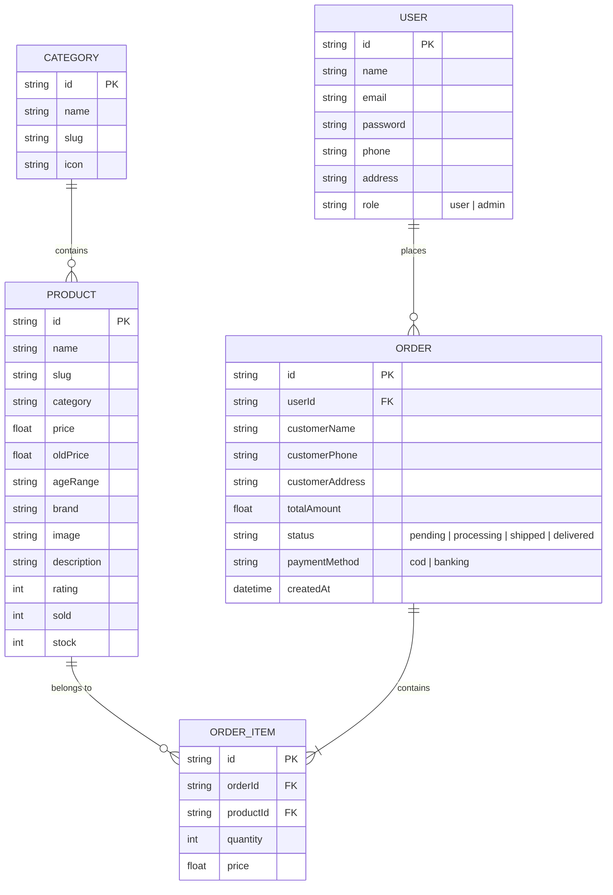

# Entity Relationship Diagram (ERD)

Sơ đồ cơ sở dữ liệu dự kiến cho hệ thống ToyKingdom. Mặc dù hiện tại dự án sử dụng Mock Data và `localStorage`, cấu trúc bên dưới được thiết kế chuẩn để dễ dàng chuyển đổi sang PostgreSQL / MongoDB khi kết nối backend thật.

